# 1. はじめに

* この記事は Unity 講習会 2024 応用編の資料です
* Unity Hub と Unity 2022.3.38f1 をインストール済み(※ 2022.3.38f1 はあくまで例)
* 任意の IDE がある(Visual studio, Rider など)

## 1.1. 題材

Unityちゃんアドベンチャーゲーム

## 1.2. 学ぶこと

* EditorLayout
* Animation
* Physics
* AudioMixer
* PrefabVariant
* ParticleSystem
* UnityPackage
* Decal Projector
* InputSystem
* TextMeshPro
* Timeline
* Cinemachine
* Terrain
* Skybox
* DepthCamera
* PostProcessing
* Lightings
* UIToolkit

## 1.3. ゲーム仕様

Unityちゃんが障害物を避けながらアイテムを回収してくるゲーム

HP が 0 になるとゲームオーバー

# 2. プロジェクトを作る

1. Unity Hub を起動

* `New Project` ボタンを押す

2. `Universal 3D` を選択

* `Project Name` は自由 (写真の例では `UnityChanAdventur` と入力)

3. `location` は自由 (特に気にしなければそのままで OK )
4. `Connect to Unity Cloud` はチェックを外す
5. `Use Unity Version Control` はチェックを外す
6. `Create project` ボタンを押す

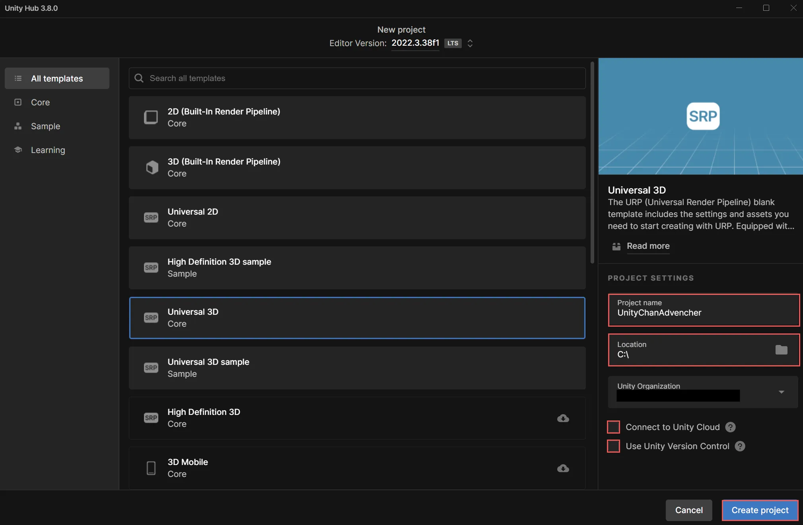

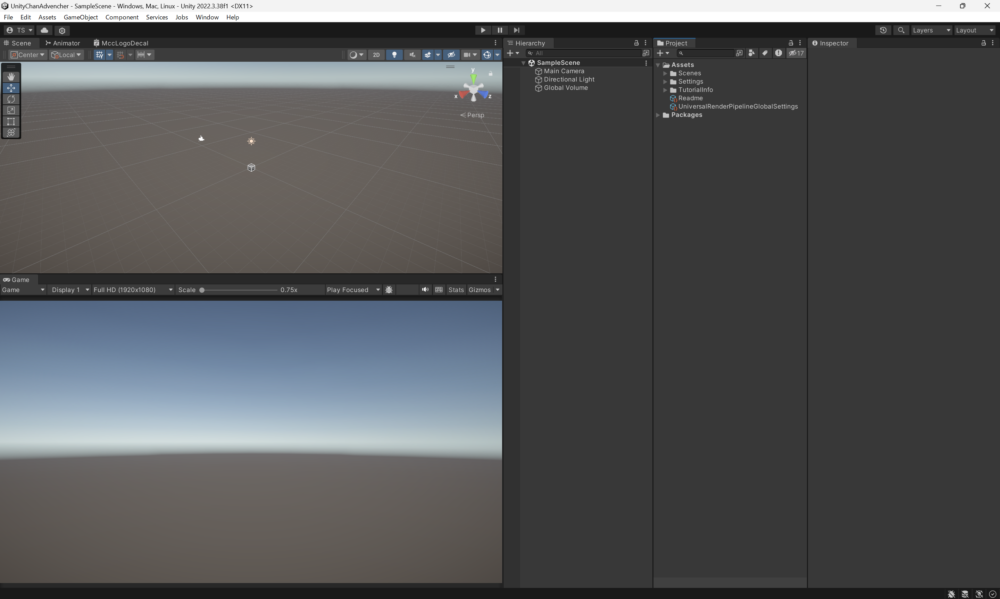

## 2.1. Unity Editor のレイアウト

Unity Editor のレイアウトは、エディタの右上にある `Layout` ボタンから変更できます。デフォルトのままで問題ありませんが、個人的に `2 by 3` にすると Scene タブと Game タブが同時に見れるのでおすすめです。

# 3. プロジェクトの設定

## 3.1. 解像度の設定

Game タブの `Free Aspect` になってる部分を `Full HD (1920x1080)` に変更します。

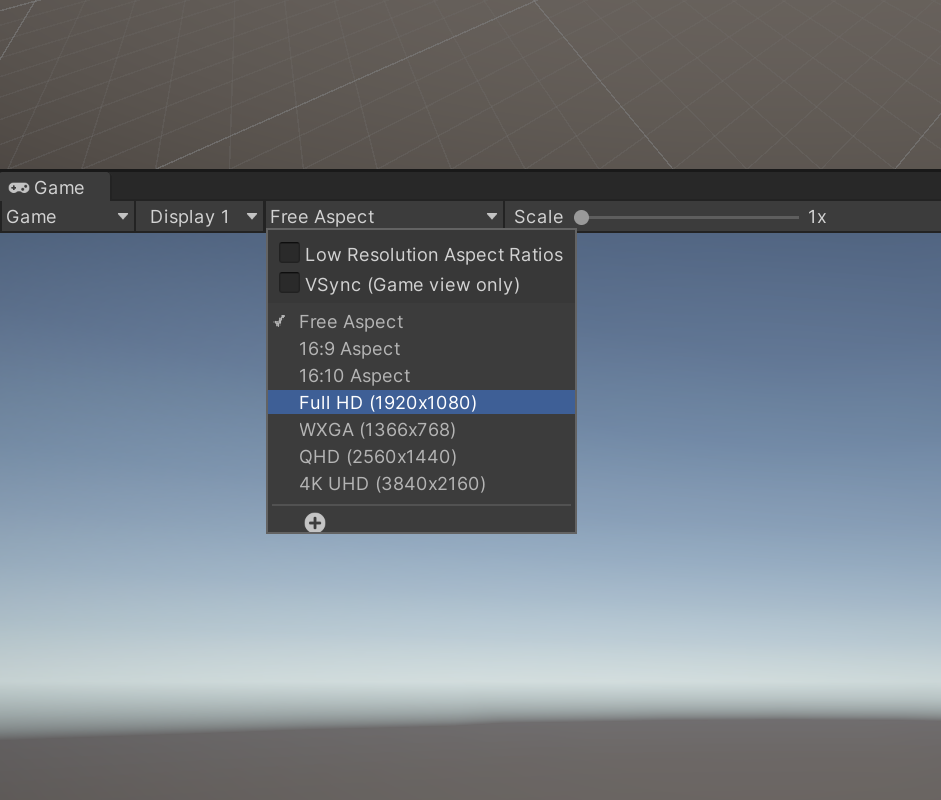

ここの設定によって、ゲームの画面サイズが変わります。今回は `Full HD (1920x1080)` に設定します。

# 4. UnityちゃんとUnityChanAdventurのアセットのインポート

ここでは、 Unityちゃんと UnityChanAdventu rのアセットの UnityPackage をダウンロードしインポートします。

UnityPackage とは、Unity Editor で使えるアセットのパッケージファイルです。Unityちゃんの UnityPackage には、Unityちゃんの 3D モデルやアニメーション、マテリアル、シェーダーなどが含まれています。

## 4.1. UnityちゃんのUnityPackageをインポート

1. [Unityちゃんの公式サイト](https://unity-chan.com/) にアクセス
2. 右上の `Data Download` をクリック
3. 利用規約に同意してダウンロードページヘ
4. `ユニティちゃん 3Dモデルデータ` をダウンロード
5. ダウンロードしたファイルを Unity Editor の `Project` タブの `Assets` にドラッグアンドドロップ

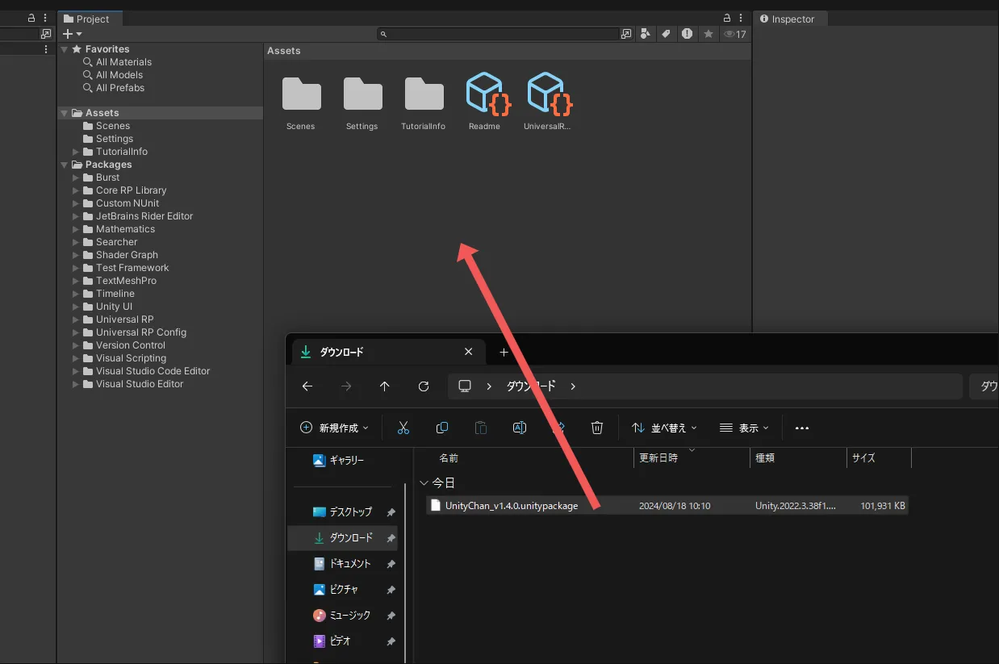

6. `import Unity Package` 画面が表示されるので、 `Import` ボタンを押す

これで Assets の中に UnityChan フォルダーができてれば OK です。

## 4.2. toonshader　のインポート

`Window` -> `Package Manager` で `Package Manager` を開く

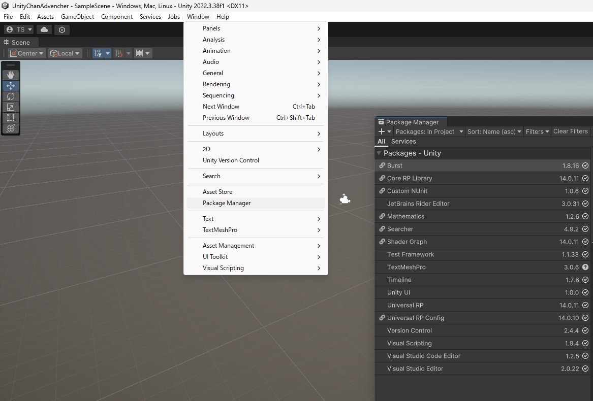

`+` ボタンを押して `Add package from git URL` を選択し、 `com.unity.toonshader` を入力して `Add` ボタンを押す(Enter を押してもOK)

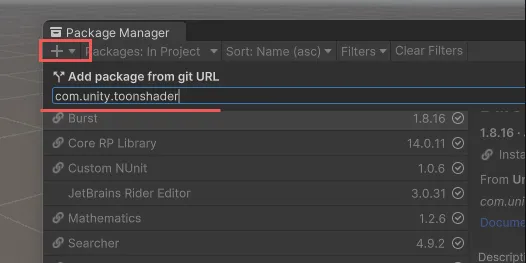

## 4.3. UnityChanAdventurのアセットのUnityPackageをインポート

UnityChanAdventurのアセットをダウンロード

TODO: あとでリンクを書く

UnityChan をインポートしたとき同様。ダウンロードしたファイルを Unity Editor の `Project` タブの `Assets` にドラッグアンドドロップし、`import Unity Package` 画面が表示されたら、 `Import` ボタンを押す。

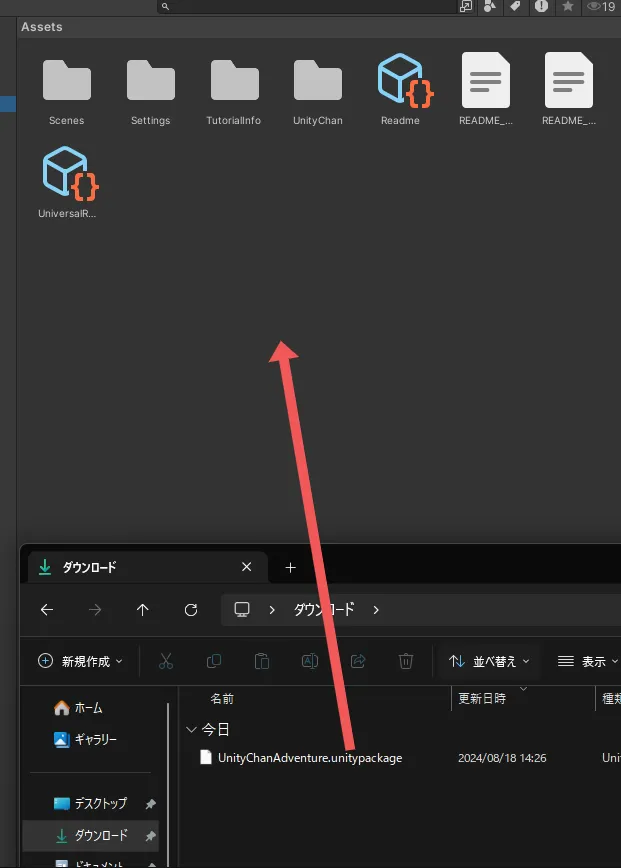

# 5. Trrain で地形を作る

ここでは、Terrain を使って地形を作ります。

Terrain は、 Unity で簡単に地形や植生といった世界を構築するためのツールです。

## 5.1. Terrain を作る

まず、 Prefab いれるフォルダを作り、ステージ用のプレハブを作ります。

`Assets` の `UnityChanAdventure` 内で右クリック -> `Create` -> `Folder` を選択し、 `Prefabs` と入力して `Enter` キーを押します。(`Prefabs` の `P` は大文字です。)

作った `Prefabs` フォルダで右クリック -> `Create` -> `Prefab` を選択し、 `Stage` と入力して `Enter` キーを押します。 `Stage` プレハブができたらダブルクリックして開きます。なにもない世界が `Scene` タブに出れば OK です。次に `Hierarchy` で右クリック -> `3D Object` -> `Terrain` を選択します。すると、大きな板(地面)ができます。

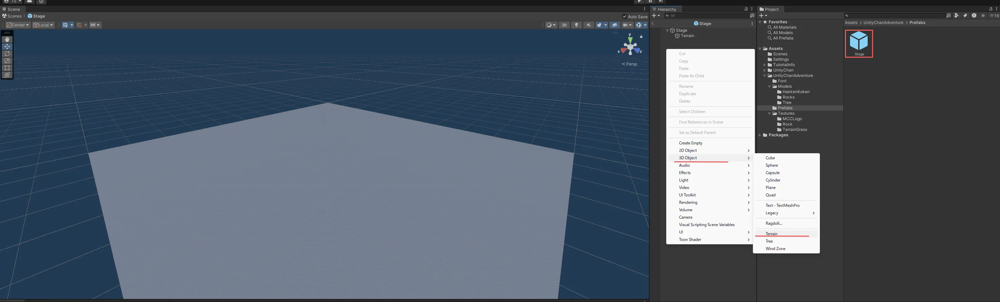

## 5.2. Terrain に草を生やす

Terrain に草を生やします。

ヒエラルキーでTerrainオブジェクトを選択し、インスペクターで `Peint Terrain` を選択し、`Set Hight` になってるところを `Paint Texture` に変更します。そして、 `Terrain Layers` で `Edit Terrain Layers` を押し、`Create Layer` を押します。プロジェクト内の画像一覧が表示されるので、草の画像を選択します。

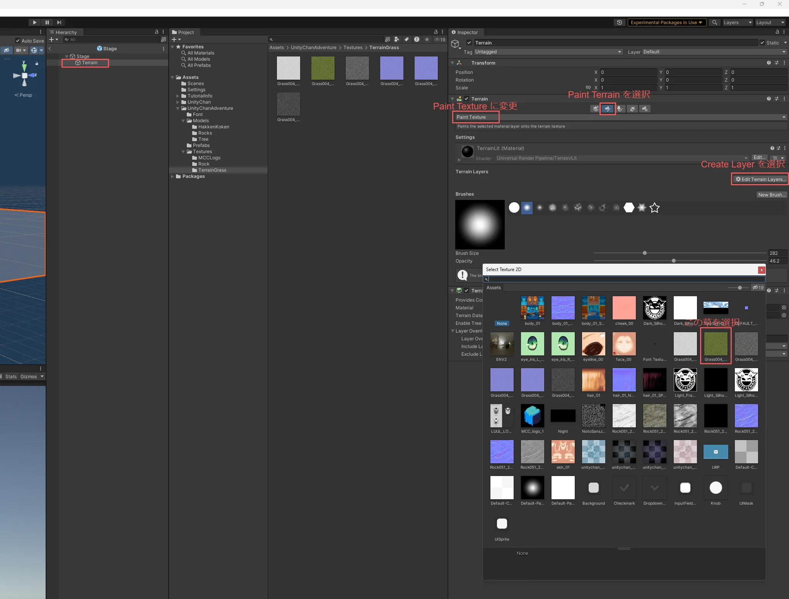

草が生えました！草のテクスチャは `/Assets/UnityChanAdventure/Textures/TerrainGrass` の中にあります。Terrain のレイヤーデータはこのフォルダに作られます。このファイルの名前を変えると、レイヤーの名前も変わります。以下の画像ではレイヤー名を `Kusa` に変更しています。

## 5.3. Terrain に地形を作る

Terrain に地形を作ります。ヒエラルキーでTerrainオブジェクトを選択し、インスペクターで `Peint Terrain` を選択し、先ほど`Paint Texture` にしたところを `Set Hight` に変更します。Treein の地形は、イラスト書くようにブラシで書くことができます。`Height` はブラシで書ける最大の高さで、 `Brushes` はブラシの形を選べます。`Brush Size` はブラシの大きさ、`Opacity` はブラシの濃さ(強さ)です。好きなブラシで強さ、サイズをセットし、 Scene で Terrain にクリックして地形を作ります。あまり高くしすぎると Unityちゃんが登れなくなってしまうので注意してください。

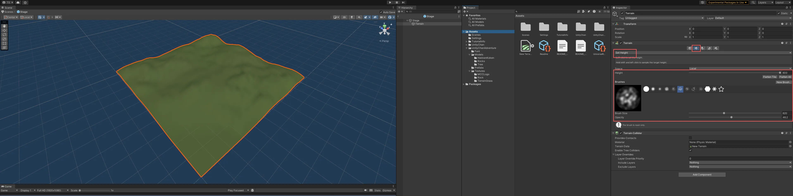

## 5.4. Terrain をシーンに置く

Terrain をシーンに置きます。`/Assets/UnityChanAdventure` に `Scenes` フォルダを作り、その中に `Main` シーンを作ります。そしてダブルクリックで `Main` シーンを開いてください。

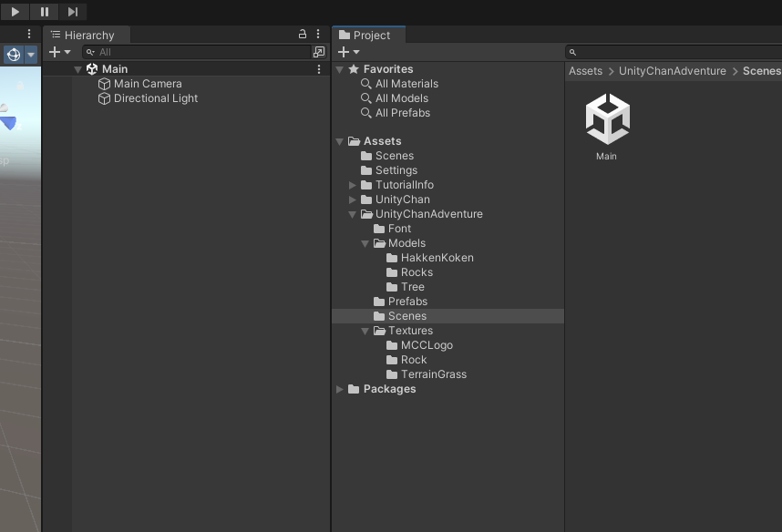

次に、先程作成した `Stage` プレハブを `Hierarchy` にドラッグアンドドロップします。

これで、Terrain がシーンに置かれました。

# 6. Unityちゃんをシーンに置く

ここでは、Unityちゃんをシーンに置きます。そして、Chinemachine を使ってカメラを設定し、Animation を使って Unityちゃんを動かします。

## 6.1. Unityちゃんのプレハブを作る

Unityちゃんのモデルの本体は `/Assets/UnityChan/Models` の中にあります。このモデルをプレハブにして、シーンに置きます。`UnityChan` を右クリックして、`Create -> PrefabVariant` を選択します。`UnityChan` プレハブができたら、`UnityaChanAventur` の `Prefabs` フォルダにドラッグアンドドロップして移動させてください。

移動させたらだぶるクリックして開きます。 unitychan の中には `Character1_Reference` と `mesh_root` があります。▼をクリックするとツリーをたたむことができます。 `Character1_Reference` は Unityちゃんのボーン情報で、 `mesh_root` は Unityちゃんの各パーツのモデルデータです。(3Dモデルの仕組みについてはこのUnity講習会では詳しく触れません。「スキニング」とか「リギング」って検索すると色々出てきます)

`unitychan` に Rigidbody と Capsule Collider を追加します。`unitychan` を選択して、インスペクターの `Add Component` をクリックし、`Rigidbody` を追加します。次に、`Add Component` をクリックし、`Capsule Collider` を追加します。

Rigidbody では、 `Constraints` の `Freeze Rotation` の `X`, `Z` をチェックします。これで Unityちゃんが回転しなくなります。Capsule Collider は、Unityちゃんの当たり判定を表します。Unityちゃんの形に合わせて調整します。`Center` を `(0, 0.8, 0)` に、`Radius` を `0.2` に、`Height` を `1.6` にします。

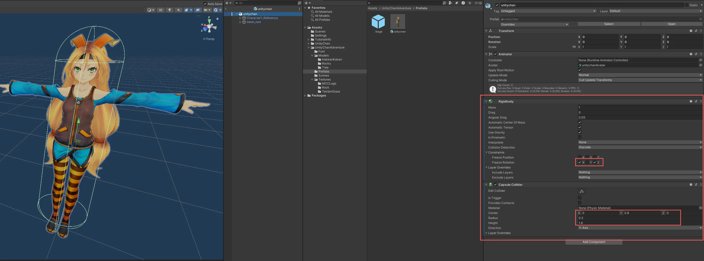

Mainシーンを開いてUnityちゃんのプレハブを置きましょう。`<`を押せば Main シーンに戻ります。`UnityChan` プレハブを `Hierarchy` にドラッグアンドドロップします。

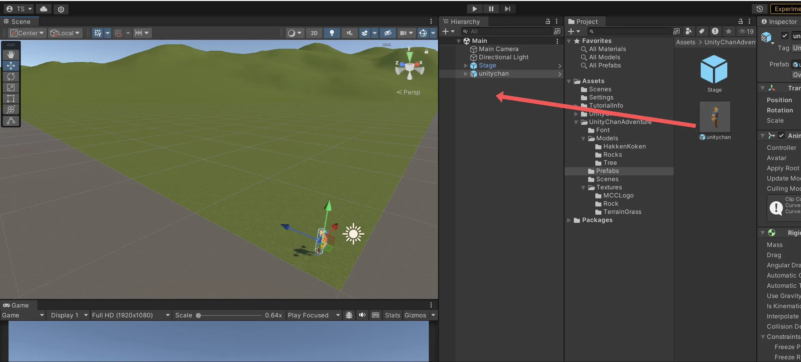

# 7. Unityちゃんを `WASD` で動かす

ここでは、Unityちゃんを `WASD` で動かすスクリプトを書きます。キー入力には `InputSystem` を使います。

## 7.1. InputSystem をインストール

`Window` -> `Package Manager` で `Package Manager` を開きます。`Packages` を `Unity Registry` に変更し、`InputSystem` の `Install` ボタンを押します。

`Edid` -> `Project Settings` で、 `Input System Package` を選択し、`Create settings asset` チェックボックスをオンにします。

`Assets` で UnityChanAdventure フォルダ内で右クリック -> `Create` -> `Input Actions` を選択し、Input Action Assets を作ります。名前は `Main` と入力してください。

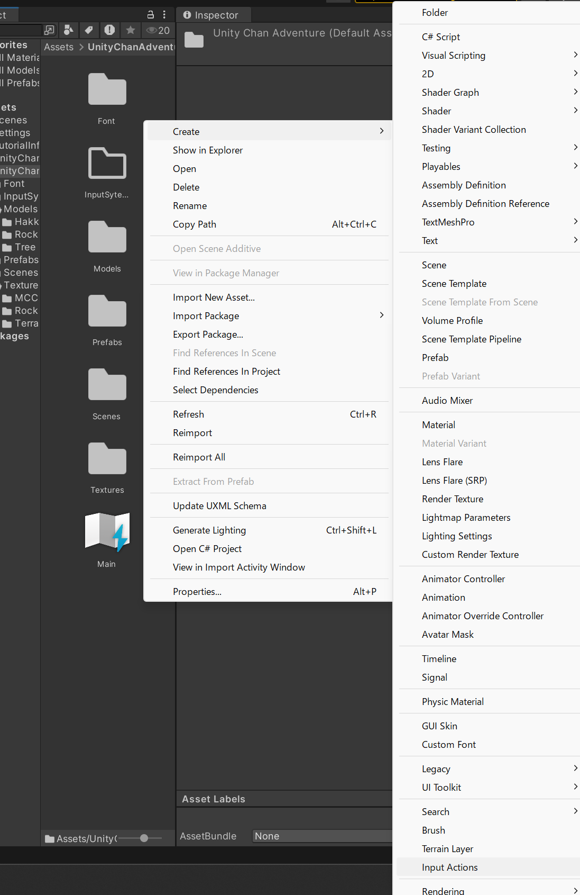

## 7.2. キー設定

Input Action Assets を開いて、Action Map の `+` ボタンを押して Action Map を追加します。名前は `Main` と入力してください。`Main` を選択して、 Actions にある `New Action` を `Move` に名前を変えてください(ダブルクリックすると変えられます)。`Action Properties` で `Action` の `Action Type` を `Button` から `Value` に変更して、 `Control Type` を `Vector2` に変更します(Control Type は Action Type を Value にしたら出てきます)。

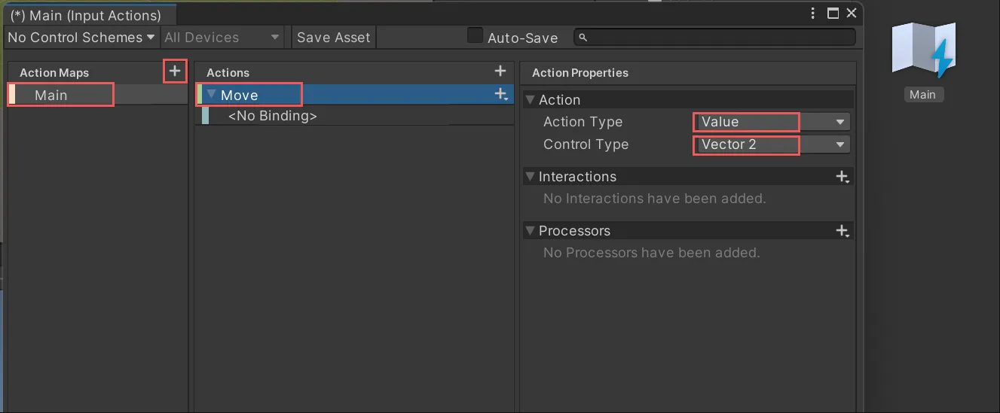

`<No Binding>` は使わないので右クリックで消しちゃってOKです。

`Move` の `+` を押して `Add Up\Down\Reft\Right Composite` を追加します。名前は `2D Vector` から `WASD` に変更します。

