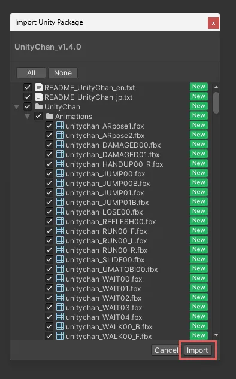

# 1. はじめに

* この記事は Unity 講習会 2024 応用編の資料です
* Unity Hub と Unity 2022.3.38f1 をインストール済み(※ 2022.3.38f1 はあくまで例)
* 任意の IDE がある(Visual studio, Rider など)

## 1.1. 題材

Unityちゃんアドベンチャーゲーム

## 1.2. 学ぶこと

* EditorLayout
* Animation
* Physics
* AudioMixer
* PrefabVariant
* ParticleSystem
* UnityPackage
* Decal Projector
* InputSystem
* TextMeshPro
* Timeline
* Cinemachine
* Terrain
* Skybox
* DepthCamera
* PostProcessing
* Lightings
* UIToolkit

## 1.3. ゲーム仕様

Unityちゃんが障害物を避けながらアイテムを回収してくるゲーム

HP が 0 になるとゲームオーバー

# 2. プロジェクトを作る

1. Unity Hub を起動

* `New Project` ボタンを押す

2. `Universal 3D` を選択

* `Project Name` は自由 (写真の例では `UnityChanAdventur` と入力)

3. `location` は自由 (特に気にしなければそのままで OK )
4. `Connect to Unity Cloud` はチェックを外す
5. `Use Unity Version Control` はチェックを外す
6. `Create project` ボタンを押す

## 2.1. Unity Editor のレイアウト

Unity Editor のレイアウトは、エディタの右上にある `Layout` ボタンから変更できます。デフォルトのままで問題ありませんが、個人的に `2 by 3` にすると Scene タブと Game タブが同時に見れるのでおすすめです。

# 3. プロジェクトの設定

## 3.1. 解像度の設定

Game タブの `Free Aspect` になってる部分を `Full HD (1920x1080)` に変更します。

ここの設定によって、ゲームの画面サイズが変わります。今回は `Full HD (1920x1080)` に設定します。

# 4. UnityちゃんとUnityChanAdventurのアセットのインポート

ここでは、 Unityちゃんと UnityChanAdventu rのアセットの UnityPackage をダウンロードしインポートします。

UnityPackage とは、Unity Editor で使えるアセットのパッケージファイルです。Unityちゃんの UnityPackage には、Unityちゃんの 3D モデルやアニメーション、マテリアル、シェーダーなどが含まれています。

## 4.1. UnityちゃんのUnityPackageをインポート

1. [Unityちゃんの公式サイト](https://unity-chan.com/) にアクセス
2. 右上の `Data Download` をクリック
3. 利用規約に同意してダウンロードページヘ
4. `ユニティちゃん 3Dモデルデータ` をダウンロード
5. ダウンロードしたファイルを Unity Editor の `Project` タブの `Assets` にドラッグアンドドロップ

6. `import Unity Package` 画面が表示されるので、 `Import` ボタンを押す

これで Assets の中に UnityChan フォルダーができてれば OK です。

## 4.2. toonshader　のインポート

`Window` -> `Package Manager` で `Package Manager` を開く

`+` ボタンを押して `Add package from git URL` を選択し、 `com.unity.toonshader` を入力して `Add` ボタンを押す(Enter を押してもOK)

## 4.3. UnityChanAdventurのアセットのUnityPackageをインポート

UnityChanAdventurのアセットをダウンロード

TODO: あとでリンクを書く

UnityChan をインポートしたとき同様。ダウンロードしたファイルを Unity Editor の `Project` タブの `Assets` にドラッグアンドドロップし、`import Unity Package` 画面が表示されたら、 `Import` ボタンを押す。

